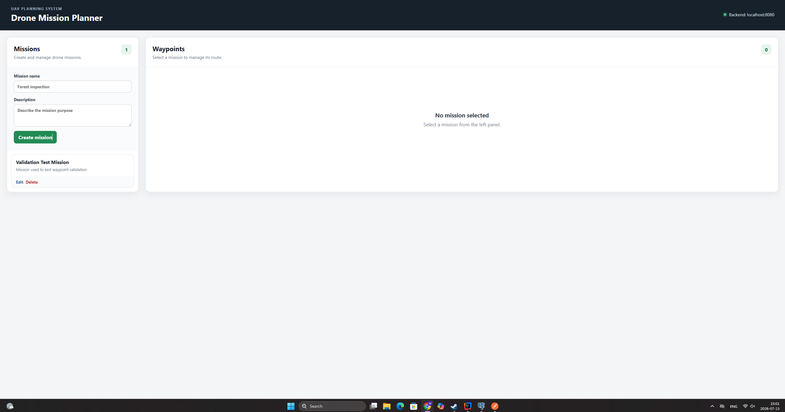

# 🚁 Drone Mission Planner

A full-stack drone mission planning application built with **Spring Boot**, **PostgreSQL**, **React**, and **TypeScript**.

The application allows users to create drone missions, manage their waypoints, and interact with a REST API through a simple web interface.

This project serves as the first step towards a complete UAV Ground Control System.

---

# 📷 Application Preview



---

# ✨ Features

## Mission Management

- Create new missions
- View all missions
- Update existing missions
- Delete missions
- Mission validation
- Success and error notifications

## Waypoint Management

- Create waypoints for a selected mission
- View all mission waypoints
- Update waypoint information
- Delete waypoints
- Automatic sorting by route order
- Coordinate validation

## REST API

- Mission CRUD
- Waypoint CRUD
- DTO request layer
- Validation
- Global exception handling
- Correct HTTP status codes
- PostgreSQL persistence
- CORS configuration

## User Interface

- React frontend
- Responsive layout
- Loading states
- Success messages
- Error messages
- Simple and clean design

---

# 🛠 Technologies

## Backend

- Java 21
- Spring Boot
- Spring Web
- Spring Data JPA
- Hibernate
- PostgreSQL
- Maven
- Jakarta Bean Validation

## Frontend

- React
- TypeScript
- Vite
- CSS
- Fetch API

## Development Tools

- IntelliJ IDEA
- Postman
- pgAdmin
- Git
- GitHub

---

# 🏗 Project Architecture

```
React Frontend
        │
        │ HTTP
        ▼
REST Controllers
        │
        ▼
Business Services
        │
        ▼
Repositories
        │
        ▼
Hibernate / JPA
        │
        ▼
PostgreSQL Database
```

---

# 📁 Project Structure

```
drone-mission-planner
│
├── frontend
│   ├── src
│   ├── public
│   ├── package.json
│   └── vite.config.ts
│
├── src
│   └── main
│       ├── java
│       │   └── com.martynas.droneplanner
│       │       ├── config
│       │       ├── controller
│       │       ├── dto
│       │       ├── entity
│       │       ├── exception
│       │       ├── repository
│       │       └── service
│       │
│       └── resources
│           └── application.properties
│
└── pom.xml
```

---

# 🌐 REST API

## Missions

| Method | Endpoint | Description |
|----------|-----------------------------|----------------------------|
| GET | `/missions` | Get all missions |
| POST | `/missions` | Create mission |
| PUT | `/missions/{missionId}` | Update mission |
| DELETE | `/missions/{missionId}` | Delete mission |

---

## Waypoints

| Method | Endpoint | Description |
|----------|--------------------------------------------|-----------------------------|
| GET | `/missions/{missionId}/waypoints` | Get mission waypoints |
| POST | `/missions/{missionId}/waypoints` | Create waypoint |
| PUT | `/waypoints/{waypointId}` | Update waypoint |
| DELETE | `/waypoints/{waypointId}` | Delete waypoint |

---

# 📥 Example Requests

## Create Mission

```json
{
  "name": "Forest Inspection",
  "description": "Inspect damaged trees after the storm."
}
```

---

## Create Waypoint

```json
{
  "latitude": 54.6872,
  "longitude": 25.2797,
  "altitude": 50,
  "orderNumber": 1
}
```

---

# ✅ Validation

## Mission

- Name is required
- Description is required
- Maximum name length
- Maximum description length

## Waypoint

- Latitude between **-90** and **90**
- Longitude between **-180** and **180**
- Altitude must be **0 or greater**
- Order number must be **greater than 0**

---

# ⚠ Error Handling

The application uses a global exception handler.

Example response:

```json
{
  "timestamp": "2026-07-15T20:30:15",
  "status": 404,
  "error": "Not Found",
  "message": "Mission not found with id: 3"
}
```

Validation errors return **HTTP 400 Bad Request**.

---

# 🚀 Running the Project

## Requirements

- Java 21
- PostgreSQL
- Node.js
- npm

---

## Clone repository

```bash
git clone https://github.com/MartynasBazaras/drone-mission-planner.git
```

---

## Configure PostgreSQL

Create database

```sql
CREATE DATABASE drone_mission_planner;
```

Configure database connection inside

```
application.properties
```

---

## Start Backend

Windows

```bash
mvnw.cmd spring-boot:run
```

Linux / macOS

```bash
./mvnw spring-boot:run
```

Backend

```
http://localhost:8080
```

---

## Start Frontend

```bash
cd frontend
npm install
npm run dev
```

Frontend

```
http://localhost:5173
```

---

# 📌 Current Status

Completed:

- ✔ Mission CRUD
- ✔ Waypoint CRUD
- ✔ PostgreSQL integration
- ✔ React frontend
- ✔ DTO validation
- ✔ Global exception handling
- ✔ HTTP status handling
- ✔ CORS configuration
- ✔ Postman tested

---

# 🛣 Future Development

The next development stages will focus on UAV software:

- Python
- PX4
- Gazebo
- MAVSDK
- Drone telemetry
- Drone commands
- GPS navigation
- Return-to-home
- ROS 2
- C++

---

# 👨‍💻 Author

**Martynas Bazaras**

Lithuania

Bachelor of Software Systems

Interested in UAV software development, backend development and autonomous drone systems.